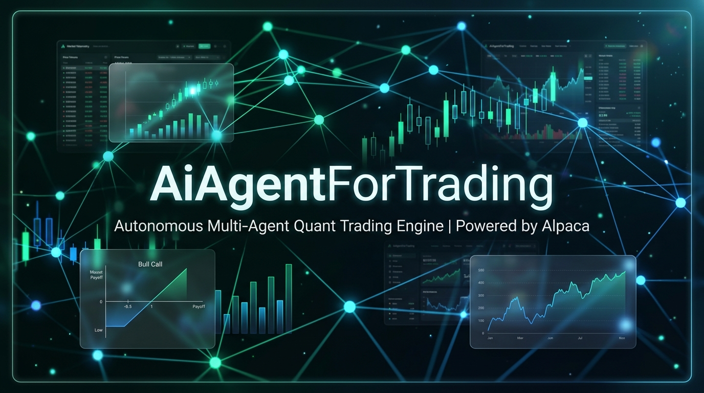
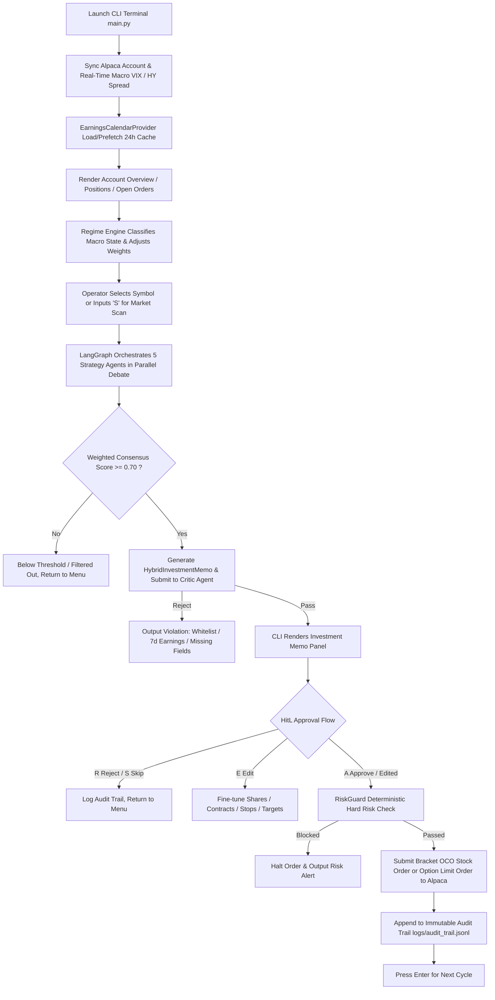

# AiAgentForTrading

<p align="center">
  
</p>

<p align="center">
  <b>English</b> | <a href="README_zh.md">简体中文</a>
</p>

An end-to-end autonomous quantitative trading, dual-track asset execution (Common Equity & Vertical Options Spreads), dynamic trailing stop, position sentinel, and deterministic risk governance system powered by **Alpaca Trading API**, **LangGraph Multi-Agent StateGraph**, and **Large Language Models (LLM)**.

The system integrates **Real-time Market Regime Detection**, **5-Strategy Agent Consensus & Debate**, **Hybrid Asset Proposal Generation (Equity / Bull Call Spread)**, **Independent Critic Gatekeeper**, **Interactive Human-in-the-Loop CLI Terminal**, **Deterministic RiskGuard**, **Cron Sentinel Position & DTE Guardian Engine**, **Full Bilingual Internationalization (i18n)**, **Dual-Channel 3-Day Log Rotation**, and **Hybrid Multi-Asset Event-Driven Backtesting Engine**.

---

## 🌟 Key Features

- **Multi-Agent Parallel Debate & Consensus Engine (LangGraph StateGraph)**:
  - **Momentum Agent**: Captures breakout trends using SMA crossovers, RSI momentum, and volume surges.
  - **Macro Agent**: Evaluates broader market risk appetite using VIX volatility and FRED High-Yield Credit Spreads.
  - **StatArb Agent**: Tracks rolling correlation and spread Z-Score mean-reversion relative to SPY.
  - **Contrarian Agent**: Identifies asymmetric risk-reward opportunities in extreme panic and oversold conditions.
  - **Exotic Agent**: Analyzes Put/Call Ratio (PCR), unusual options flow, and earnings volatility event windows.
- **5-Agent Real Consensus Market Scanner**:
  - Concurrently executes full 5-agent debate and weighted scoring across the S&P 500 core universe.
  - Strict admission threshold: Only outputs high-conviction opportunities with Consensus Score $\ge 0.70$, sorted descending by score.
  - Status badges: Automatically tags tickers with `[POSITION]`, `[PENDING]`, or `[NEW]` to prevent chasing and duplicate orders.
  - Shortcut and standalone mode: Input `S` in the terminal or run `main.py --scan` to output recommendation tables and submit direct orders by index.
- **Full Bilingual Internationalization (i18n)**:
  - Runtime language switching: Type `L`, `EN`, or `ZH` on the terminal homepage anytime.
  - CLI startup flags: Pass `-l en` or `-l zh` to launch in your preferred language.
  - Global configuration: Set default language (`en` or `zh`) in `config/settings.yaml`.
  - Fully localized Agent rationales, dashboard tables, investment memos, and HitL governance prompts.
  - Error diagnostics prioritize standard English for clarity and rapid troubleshooting.
- **24-Hour Cached Earnings Calendar Provider (EarningsCalendarProvider)**:
  - Built on `yfinance` with local disk JSON persistent caching to accurately track next earnings dates and remaining days (`days_to_earnings`).
  - 24-hour TTL automatic refresh with multithreaded prefetching to eliminate redundant API calls.
  - Coupled with Exotic Agent for event risk assessment and Critic Agent for 7-day earnings blackout veto.
- **Dynamic Macro Regime Engine**:
  - Automatically identifies `Bull_Trend`, `High_Vol_Bear`, `Panic_Crisis`, and `Neutral_Range`.
  - Dynamically adjusts the 5-agent strategy weight matrix based on the prevailing macro state.
- **Hybrid Asset Execution (Common Stock + Bull Call Spreads)**:
  - **Common Stock**: Robust allocation in clear trends and lower volatility regimes via Bracket OCO (Take-Profit + Stop-Loss) orders.
  - **Bull Call Spread (Options)**: Leverages high-consensus, high-momentum setups with defined risk via `place_option_limit_order`.
  - **Smart Asset Routing**: Supports `AUTO` (smart balancing), `EQUITY` (stock only), and `OPTION` (options only).
- **Rich Terminal UI & Positions / Open Orders Dashboard**:
  - **Positions Dashboard**: Visualizes stock, options, and Treasury ETF holdings with quantity, average cost, market price, market value, intraday change, and unrealized P&L with color-coded styling.
  - **Open Orders Dashboard**: Displays open order IDs, symbols, sides, types, quantities, unfilled sizes, limit/stop prices, order structures (OCO/Bracket/Limit), and status.
  - **Interactive Shortcuts**: Press `P` for positions, `O` for open orders, `S` for market scanner, and `L` to toggle language.
  - **One-off CLI Commands**: `main.py -p` (positions), `main.py -o` (orders), `main.py -sc` (scanner), `main.py -s` (full status).
- **Dual-Layer Risk Defense & Trailing Stop Protection**:
  - **Critic Independent Gatekeeper**: Asset-type adaptive validation, universe whitelist verification, options DTE constraints (14–60 days), max premium cost ($\le 2.0\%$), and 7-day earnings blackout veto.
  - **Deterministic Python RiskGuard**: Non-LLM code-level hard limits on max single stock position (10%), single option premium (2.0%), total options portfolio exposure (10.0%), sector concentration (30%), and intraday loss circuit breaker (5%).
  - **Trailing Stop & Break-Even Ladder**: Automatically moves stop loss to break-even (0%) at +25% options unrealized gain, and locks in +15% profit at +40% gain.
- **Cron Sentinel Position & DTE Guardian**:
  - **Sentinel DTE Guard**: Automatically market-closes option positions when `DTE <= 2` days to lock in spread value and eliminate assignment/expiration risks.
  - **Orphan Position OCO Auto-Healing**: Periodically audits equity holdings, cleans up dangling single-leg orders, and attaches missing OCO bracket protection.
  - **Idle Cash Treasury Sweep**: Sweeps excess idle cash into ultra-short Treasury ETF (SGOV, ~4.5% APY), dynamically sizing by available buying power.
  - **Dual-Channel Logging & 3-Day Auto-Purge**: Console and `logs/sentinel.log` synchronized output with daily rotation and automatic cleanup of logs older than 3 days.
- **Hybrid Multi-Asset Event-Driven Backtesting Engine (HybridStrategyBacktester)**:
  - Historical simulation of combined stock and option spread strategies against real daily price and VIX data.
  - Automated output of Data Quality Reports, Equity Curves (CAGR, MaxDD, Sharpe, Sortino), Asset-Class Performance Breakdown, and Exit Reason Attribution.
- **Human-in-the-Loop CLI Governance (HitL)**:
  - Interactive terminal REPL workflow powered by `rich`.
  - In-place parameter fine-tuning for shares, contracts, stop-loss, and take-profit levels.
  - Direct actions: Approve (`A`), Reject (`R`), Edit (`E`), or Skip (`S`).
- **Immutable Audit Trail**:
  - All submitted orders, parameter adjustments, and sentinel auto-healing events are recorded in `logs/audit_trail.jsonl`.

---

## 🏗️ System Architecture



---

## 📁 Directory Structure

```text
AiAgentForTrading/
├── backtest/                          # Historical backtesting framework
│   ├── __init__.py                    # Module export
│   ├── backtest_engine.py             # Event-driven backtest engine
│   ├── config.py                      # Backtest parameters & position data models
│   └── hybrid_backtester.py           # Stock + Options hybrid backtester (trailing stops, DTE guard)
├── cli/
│   ├── __init__.py                    # CLI package initialization
│   ├── i18n.py                        # Bilingual i18n module (EN/ZH translation & state)
│   └── terminal_ui.py                 # Rich terminal UI components (scanner, positions, orders, memo)
├── config/
│   ├── settings.yaml                  # System configuration (Alpaca, Featherless, FRED, Language, Risk)
│   ├── investment_memo.yaml           # Critic Agent compliance rules (Stock & Options)
│   ├── sp500_universe.json            # S&P 500 core universe whitelist (40+ blue chips)
│   └── earnings_cache.json            # Local 24-hour earnings calendar cache
├── core/
│   ├── agents/                        # 5 Strategy Agents + Critic Agent
│   │   ├── base_agent.py              # Base agent class with bilingual prompt support
│   │   ├── momentum_agent.py          # Momentum trend strategy agent
│   │   ├── macro_agent.py             # Macro fundamental analysis agent
│   │   ├── statarb_agent.py           # Statistical arbitrage & mean-reversion agent
│   │   ├── contrarian_agent.py        # Contrarian & oversold reversal agent
│   │   ├── exotic_agent.py            # Derivatives & event-driven agent
│   │   └── critic_agent.py            # Independent compliance & veto agent
│   ├── alpaca_client.py               # Unified Alpaca API gateway (Stock, Options, Orders, SGOV sweep)
│   ├── consensus_engine.py            # LangGraph multi-agent consensus & hybrid decision engine
│   ├── earnings_provider.py           # 24-hour cached earnings calendar provider (yfinance)
│   ├── market_scanner.py              # 5-Agent parallel consensus scanner
│   ├── options_engine.py              # Bull Call Spread pricing & selection engine
│   ├── regime_engine.py               # Macro market regime engine (VIX / HY Spread)
│   ├── risk_guard.py                  # Deterministic Python hard risk gateway
│   └── logger.py                      # Logging infrastructure (Console + File dual-channel, 3-day purge)
├── logs/                              # Logs and audit trail storage
│   ├── sentinel.log                   # Sentinel guardian daily rotation log
│   └── audit_trail.jsonl              # Live trading audit trail (JSON Lines)
├── sentinel/
│   ├── __init__.py                    # Sentinel package initialization
│   └── cron_sentinel.py               # 15-min health guardian, DTE exit & OCO repair engine
├── tests/                             # Automated test suite
│   ├── test_alpaca_client.py          # Alpaca integration & mock tests
│   ├── test_critic_agent.py           # Critic adaptive validation tests
│   ├── test_earnings_provider.py      # Earnings calendar 24h cache & TTL tests
│   ├── test_scanner.py                # 5-Agent consensus scanner tests
│   ├── test_terminal_ui.py            # Rich terminal dashboard rendering tests
│   ├── test_logger.py                 # Logger dual-channel & log rotation tests
│   ├── test_fetch_regime_real.py      # Real macro data fetch tests
│   ├── test_historical_data_validation.py # Backtest data quality validation tests
│   ├── test_hybrid_backtester.py      # Hybrid backtesting engine tests
│   ├── test_options_engine.py         # Option pricing and Greeks tests
│   ├── test_regime_engine.py          # Macro regime state machine tests
│   └── test_risk_guard.py             # RiskGuard hard rules boundary tests
├── main.py                            # Interactive CLI trading terminal
├── run_backtest.py                    # Real-data hybrid backtest runner
├── pyproject.toml                     # Project packaging & dependencies (uv / pytest)
├── requirements.txt                   # Dependencies list
├── README.md                          # English documentation (this file)
└── README_zh.md                       # Simplified Chinese documentation
```

---

## 🚀 Quick Start

### 1. Prerequisites
We recommend using the high-performance Python package manager [uv](https://github.com/astral-sh/uv):

```powershell
# Clone the repository
git clone https://github.com/Tonytan123/AiAgentForTrading.git
cd AiAgentForTrading

# Install and synchronize dependencies
uv sync
```

### 2. Configure API Credentials
The system supports configuration via **`config/settings.yaml`**, **`.env` file**, or **environment variables**:

#### Option A: Edit `config/settings.yaml`
```yaml
alpaca:
  api_key: "YOUR_ALPACA_API_KEY"
  secret_key: "YOUR_ALPACA_SECRET_KEY"
  paper: true

system:
  language: "en"  # UI language: "en" (English, default) or "zh" (Chinese)

featherless:
  base_url: "https://api.featherless.ai/v1"
  api_key: "YOUR_FEATHERLESS_API_KEY"
  model: "Qwen/Qwen2.5-72B-Instruct"

fred:
  api_key: "YOUR_FRED_API_KEY"
```

> 💡 **Security Tip**: After setting real credentials in `config/settings.yaml`, run `git update-index --skip-worktree config/settings.yaml` to prevent accidental Git commits.

#### Option B: Use Environment Variables
```powershell
# PowerShell (Windows)
$env:ALPACA_API_KEY="YOUR_ALPACA_KEY"
$env:ALPACA_SECRET_KEY="YOUR_ALPACA_SECRET"
$env:FEATHERLESS_API_KEY="YOUR_FEATHERLESS_KEY"
$env:FRED_API_KEY="YOUR_FRED_KEY"
```

---

## 💻 Running the System

### 1. Interactive CLI Trading Terminal

```powershell
# Launch with default settings (English by default)
uv run python main.py

# Launch explicitly in English
uv run python main.py -l en

# Launch explicitly in Chinese
uv run python main.py -l zh
```

- **Runtime Language Switching**:
  - Type `L` or `LANG`: Toggle between English and Chinese instantly.
  - Type `EN`: Switch directly to English.
  - Type `ZH`: Switch directly to Chinese.
- **5-Agent Market Scan & Single Ticker Analysis**:
  - Type `S` or `SCAN`: Trigger 5-agent consensus scanning across the S&P 500 universe. Displays the top opportunities and lets you enter a row number to review and order.
  - Enter a ticker symbol (e.g. `NVDA`): Performs targeted multi-agent analysis and generates an investment memo.
- **Interactive Shortcuts**:
  - `P` / `POS`: Refresh the positions dashboard with one-click sell order options.
  - `O` / `ORD`: Refresh and inspect/cancel active open orders.
  - `exit` / `q`: Exit cleanly.

### 2. One-Off CLI Commands

Execute tasks directly without entering the interactive loop:
```powershell
# Scan market and output top recommendations
uv run python main.py --scan -l en      # English output
uv run python main.py --scan -l zh      # Chinese output

# View active positions
uv run python main.py --positions       # or main.py -p

# View active open orders
uv run python main.py --orders          # or main.py -o

# View comprehensive account overview, positions, and orders
uv run python main.py --status          # or main.py -s
```

### 3. Run 15-Minute Cron Sentinel Guardian

Monitors position health, heals missing OCO protective orders, enforces DTE exit for expiring options, and sweeps idle cash into Treasury ETF:

```powershell
# Start daemon process (runs every 15 mins with 3-day log rotation)
uv run python -m sentinel.cron_sentinel --daemon -l en   # English logs (default)
uv run python -m sentinel.cron_sentinel --daemon -l zh   # Chinese logs

# Run a single inspection and self-healing cycle
uv run python -m sentinel.cron_sentinel -l en
```

### 4. Run Hybrid Strategy Backtester

Runs an event-driven backtest on 30+ S&P 500 blue chips and VIX historical daily data:

```powershell
uv run python run_backtest.py
```

### 5. Run Automated Test Suite

```powershell
uv run pytest tests/ -v
```

---

## 🐳 Docker Deployment

```bash
# 1. Build Docker image
docker build -t aiagentfortrading:latest .

# 2. Run interactive trading terminal
docker run -it --rm \
  -v ${PWD}/config:/app/config \
  -v ${PWD}/logs:/app/logs \
  -e ALPACA_API_KEY="YOUR_KEY" \
  -e ALPACA_SECRET_KEY="YOUR_SECRET" \
  -e FEATHERLESS_API_KEY="YOUR_KEY" \
  aiagentfortrading:latest python main.py

# 3. Start Sentinel daemon with Docker Compose
docker compose up -d sentinel
```

---

## ⚙️ Core Risk Rules Matrix

| Rule | Threshold | Trigger & Action |
| :--- | :--- | :--- |
| **Max Single Stock Position** | `$\le 10.0\%$` | Caps portfolio equity exposure per symbol |
| **Max Option Premium** | `$\le 2.0\%$` | Limits net premium paid per option spread |
| **Total Options Exposure** | `$\le 10.0\%$` | Limits aggregate premium across all active options |
| **Sector Concentration** | `$\le 30.0\%$` | Mitigates industry-specific concentration risk |
| **Intraday Loss Circuit Breaker** | `$\le 5.0\%$` | Halts new order entry on severe intraday drawdowns |
| **Earnings Blackout Window** | `$\le 7 \text{ days}$` | Vetoes entries within 7 days of binary earnings events |
| **Option DTE Target** | `14 ~ 60 \text{ days}` | Prohibits 0DTE trading; ensures adequate time value |
| **Sentinel DTE Guard** | `\text{DTE} \le 2 \text{ days}` | Market-closes options to lock value and eliminate assignment risk |
| **Orphan Position OCO Healing** | `Missing OCO` | Automatically attaches Bracket OCO (Take-Profit & Stop-Loss) |
| **Trailing Stop / Break-Even** | `+25\% / +40\%` | Shifts stop to BE (0%) at +25% gain; locks +15% profit at +40% |
| **Underlying Equity Stop-Loss** | `-4.0\%` | Closes options spread when underlying breaches support level |
| **Log Lifecycle Management** | `3 \text{ days}` | Dual-channel logging; automatically deletes logs older than 3 days |

---

## 📜 License

This project is licensed under the [MIT License](LICENSE).
