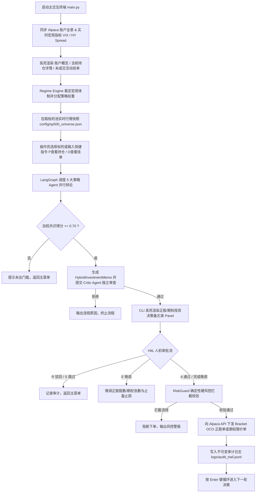

# AiAgentForTrading

基于 **Alpaca API**、**LangGraph 多智能体协同状态图** 与 **大语言模型（LLM）** 的全流程量化交易决策、正股与垂直价差期权双轨执行、动态移动止盈止损及风险治理系统。

系统集成了 **实时宏观体制检测（Market Regime）**、**5 大策略研究智能体并行辩论与共识**、**正股/垂直价差期权混合资产提案生成（Hybrid Memo / Bull Call Spread）**、**独立 Critic 审查**、**CLI 人机协同决策治理（Human-in-the-Loop）**、**确定性硬风控拦截（RiskGuard）**、**持仓与期权临期守护引擎（Sentinel）**、**日志双通道与3天生命周期清理** 以及 **股票+期权多品种事件驱动回测引擎（HybridStrategyBacktester）**。

---

## 🌟 核心特性

- **多智能体并行辩论与共识机制 (LangGraph StateGraph)**：
  - **Momentum Agent (动量策略)**：基于均线突破 (SMA)、RSI 与成交量异动捕捉趋势。
  - **Macro Agent (宏观基本面)**：结合 VIX 恐慌指数与 FRED 高收益信用利差评估市场风险偏好。
  - **StatArb Agent (统计套利)**：监控与 SPY 标杆的滚动相关系数与价差 Z-Score 均值回归。
  - **Contrarian Agent (逆向投资)**：利用市场恐慌指数与超卖程度逆势寻找非对称博弈机会。
  - **Exotic Agent (衍生品与事件驱动)**：分析期权看涨/看跌比率 (PCR)、异常期权活动与财报窗口期。
- **动态宏观体制裁定 (Regime Engine)**：
  - 自动识别 `Bull_Trend` (多头趋势)、`High_Vol_Bear` (高波熊市)、`Panic_Crisis` (恐慌危机) 与 `Neutral_Range` (震荡模式)。
  - 依据宏观模式动态调配 5 大策略智能体的权重矩阵。
- **正股 + 牛市看涨期权价差双轨资产决策 (Hybrid Investment Memo & Bull Call Spread)**：
  - **正股配置（Common Stock）**：趋势明显或低波动环境下稳健配置。
  - **牛市看涨垂直价差策略（Bull Call Spread）**：自动构建买入低行权价 Call (Long Leg) + 卖出高行权价 Call (Short Leg)，压降权利金支出并规避波动率暴跌风险。
  - **智能资产路由**：支持 `AUTO`（智能权衡）、`EQUITY`（仅正股）与 `OPTION`（仅期权）。
  - **Black-Scholes 期权二元定价与希腊字母计算**：精确计算组合 Net Delta、Net Gamma、Net Theta 与 Net Vega。
- **持仓详情与活动挂单终端富文本看板 (Positions & Open Orders Dashboard)**：
  - **持仓看板**：清晰展示正股、期权与国债 ETF 的持仓数量、均价、市价、市值、当日涨跌、浮动盈亏（金额与比例红绿配色）及组合总汇总。
  - **挂单看板**：清晰展示所有未成交订单的委托编号、标的代码、买卖方向、类型、委托量、已成交量、未成交量、限价/止损价、订单结构（OCO/Bracket）与状态。
  - **交互快捷指令**：终端输入 `P` 随时刷新查看持仓；输入 `O` 随时刷新查看活动挂单。
  - **单次命令行参数**：支持 `main.py -p`（持仓）、`main.py -o`（挂单）、`main.py -s`（全景看板）快速查询。
- **双重风控防御与移动止盈保本体系**：
  - **Critic 独立合规审查**：校验标的池白名单、期权 DTE 周期约束 (14 ~ 60天)、权利金成本上限 (<=2.0%) 以及 7 天二元财报事件一票否决。
  - **确定性 Python 硬风控 (RiskGuard)**：不依赖 LLM，代码级拦截正股单仓上限 (10%)、期权单笔权利金 (2.0%)、期权总敞口 (10.0%)、板块集中度 (30%) 及日内浮亏熔断 (5%)。
  - **阶梯保本 / 移动止盈 (Trailing Stop & Break-Even Protection)**：期权浮盈达 +25% 时止损线上移至成本价（BE 0%），浮盈达 +40% 时止损线上移锁定 +15% 利润。
- **持仓巡检与期权临期守护引擎 (Cron Sentinel)**：
  - **Sentinel 临期平仓 (DTE Guard)**：期权持仓 `DTE <= 3` 天时自动市价平仓锁定剩余价差价值，彻底规避行权交割与末日流动性风险。
  - **孤儿持仓 OCO 自愈**：定时巡检正股持仓，自动清理单边残单并补发完整的 OCO（限价止盈 + 止损）双向挂单。
  - **闲置资金智能清扫**：每日将多余闲置资金买入超短期国债 ETF (SGOV, 年化 ~4.5%)，动态适配可用购买力并自动防重。
  - **日志双通道与 3 天自动清理**：控制台与 `logs/sentinel.log` 文件同步输出（UTF-8 编码），每日零点自动轮转，并自动扫描清理超过 3 天的历史过期日志。
- **混合策略历史回测引擎 (HybridStrategyBacktester)**：
  - 支持股票 + 期权价差在真实历史行情（Yahoo Finance / yfinance 真实日 K 与 VIX）下的事件驱动回测。
  - 自动输出 **数据质量检验报告（Data Quality Report）**、**整体资产净值曲线（CAGR / MaxDD / Sharpe / Sortino）**、**分品种独立收益拆解（Stock vs Option）** 及 **出场原因归因明细**。
- **人机协同终端治理 (HitL CLI Terminal)**：
  - 丰富的富文本交互看板（`rich`），支持连续分析决策（REPL 循环）。
  - 支持分资产类型参数微调（正股股数 vs 期权张数与止盈止损）。
  - 一键执行审批 (`A`)、驳回 (`R`)、微调参数 (`E`) 或跳过 (`S`)，审批通过后自动下发 Bracket OCO 或期权限价单。
- **不可变审计追踪 (Audit Trail)**：
  - 所有订单下发、参数变更与持仓自愈记录均写入不可篡改的 `logs/audit_trail.jsonl`。

---

## 🏗️ 系统架构流程



---

## 📁 项目目录结构

```text
AiAgentForTrading/
├── backtest/                          # 历史回测系统
│   ├── __init__.py                    # 回测模块导出
│   ├── backtest_engine.py             # 经典事件驱动回测引擎
│   ├── config.py                      # 回测参数配置与混合持仓数据模型
│   └── hybrid_backtester.py           # 股票+期权价差混合回测核心引擎 (移动止盈/阶梯保本/临期平仓)
├── cli/
│   └── terminal_ui.py                 # 终端富文本渲染看板 (持仓表/挂单表/决策备忘录 Panel)
├── config/
│   ├── settings.yaml                  # 全局系统配置 (Alpaca / Featherless / FRED / 风控阈值)
│   ├── investment_memo.yaml           # Critic 独立审查合规规则 (正股 + 期权)
│   └── sp500_universe.json            # 标普 500 核心标的池白名单 (40+ 核心蓝筹覆盖各行业)
├── core/
│   ├── agents/                        # 5 大策略研究 Agent 与 Critic Agent
│   │   ├── base_agent.py              # 智能体基类 (抽象评估接口与 LLM 封装)
│   │   ├── momentum_agent.py          # 动量趋势智能体
│   │   ├── macro_agent.py             # 宏观基本面智能体
│   │   ├── statarb_agent.py           # 统计套利智能体
│   │   ├── contrarian_agent.py        # 逆向反转智能体
│   │   ├── exotic_agent.py            # 衍生品与事件驱动智能体
│   │   └── critic_agent.py            # 独立审查智能体 (一票否决权)
│   ├── alpaca_client.py               # Alpaca API 统一网关客户端 (正股/期权/持仓/挂单/国债清扫)
│   ├── consensus_engine.py            # 基于 LangGraph 的多智能体共识与混合资产决策引擎
│   ├── options_engine.py              # 期权牛市看涨价差 (Bull Call Spread) 定价与推荐引擎
│   ├── regime_engine.py               # 宏观体制状态机引擎 (VIX / HY Spread)
│   ├── risk_guard.py                  # 确定性 Python 硬风控网关 (正股 + 期权风控)
│   └── logger.py                      # 统一日志基础设施 (Console+File双通道与3天过期清理)
├── logs/                              # 日志与审计追踪存储目录
│   ├── sentinel.log                   # 巡检守护每日轮转持久化日志
│   └── audit_trail.jsonl              # 真实交易审计追踪日志 (JSON Lines)
├── sentinel/
│   └── cron_sentinel.py               # 15分钟持仓健康巡检、期权临期平仓与OCO挂单守护引擎
├── tests/                             # 自动化单元测试与回测验证套件
│   ├── test_alpaca_client.py          # Alpaca 接口集成与 Mock 单元测试
│   ├── test_terminal_ui.py            # 终端持仓与挂单表格富文本渲染测试
│   ├── test_logger.py                 # 双通道日志输出与 3 天过期清理测试
│   ├── test_fetch_regime_real.py      # 宏观数据拉取与 Regime 测试
│   ├── test_historical_data_validation.py # 回测历史数据质量校验测试
│   ├── test_hybrid_backtester.py      # 混合回测引擎风控与交易逻辑测试
│   ├── test_options_engine.py         # 期权定价、价差与希腊字母计算测试
│   ├── test_regime_engine.py          # 宏观状态机逻辑测试
│   └── test_risk_guard.py             # 硬风控全规则边界与混合资产测试
├── main.py                            # CLI 交互式双轨交易终端主入口 (支持看板与参数查询)
├── run_backtest.py                    # 真实历史行情全资产回测执行脚本
├── pyproject.toml                     # 项目依赖与工具链配置 (uv / pytest)
├── requirements.txt                   # Python 依赖清单
└── README.md                          # 项目说明文档
```

---

## 🚀 快速上手

### 1. 环境准备
推荐使用高性能 Python 包管理器 [uv](https://github.com/astral-sh/uv)：

```powershell
# 克隆仓库
git clone https://github.com/Tonytan123/AiAgentForTrading.git
cd AiAgentForTrading

# 安装并同步项目所有依赖
uv sync
```

### 2. 配置 API 凭证
系统支持 **`config/settings.yaml`**、**`.env` 文件** 或 **系统环境变量** 三种方式进行密钥配置：

#### 方式 A：直接编辑 `config/settings.yaml`
```yaml
alpaca:
  api_key: "你的_ALPACA_API_KEY"
  secret_key: "你的_ALPACA_SECRET_KEY"
  paper: true

featherless:
  base_url: "https://api.featherless.ai/v1"
  api_key: "你的_FEATHERLESS_API_KEY"
  model: "Qwen/Qwen2.5-72B-Instruct"

fred:
  api_key: "你的_FRED_API_KEY"
```

> 💡 **安全提示**：在本地 `config/settings.yaml` 中配置真实密钥后，建议运行 `git update-index --skip-worktree config/settings.yaml` 防止 Git 意外提交私密配置。

#### 方式 B：使用环境变量配置
```powershell
# PowerShell (Windows)
$env:ALPACA_API_KEY="你的_ALPACA_KEY"
$env:ALPACA_SECRET_KEY="你的_ALPACA_SECRET"
$env:FEATHERLESS_API_KEY="你的_FEATHERLESS_KEY"
$env:FRED_API_KEY="你的_FRED_KEY"
```

---

## 💻 运行系统

### 1. 启动交互式交易终端 (CLI Terminal)

```powershell
uv run python main.py
```

- **账户与宏观看板**：自动同步 Alpaca 账户净值、可用购买力、现金余额、SGOV 国债理财与宏观 Regime。
- **当前持仓与活动挂单**：自动高亮渲染当前账户持仓详情与全部未成交订单。
- **标的池与交易倾向**：输入标的代码或序号，选择 `AUTO` / `EQUITY` / `OPTION`。
- **快捷交互指令**：
  - 输入 `P` / `POS`：即时刷新并单独查看持仓详情。
  - 输入 `O` / `ORD`：即时刷新并单独查看未成交活动挂单。
  - 输入 `exit` 或 `q`：随时安全退出系统。

### 2. 命令行单次快速查询

无需进入主交互循环，直接在终端中快速查看：
```powershell
# 查看当前持仓详情
uv run python main.py --positions   # 或 main.py -p

# 查看未成交活动挂单
uv run python main.py --orders      # 或 main.py -o

# 完整查看账户概览、持仓与挂单看板
uv run python main.py --status      # 或 main.py -s
```

### 3. 运行 15 分钟持仓守护与期权临期巡检 (Cron Sentinel)

自动检查持仓健康度、补齐 OCO 保护单、执行期权临期平仓与闲置资金国债清扫：

```powershell
# 启动常驻后台守护进程 (每 15 分钟循环巡检，自动清理过期日志)
uv run python -m sentinel.cron_sentinel --daemon

# 或执行单次巡检与自我修复
uv run python -m sentinel.cron_sentinel
```

### 4. 运行股票与期权混合策略历史回测

拉取 30+ 支标普 500 核心标的与 VIX 真实历史日 K，模拟多智能体共识与价差策略：

```powershell
uv run python run_backtest.py
```

### 5. 运行全套自动化测试套件

```powershell
uv run pytest tests/ -v
```

---

## 🐳 Docker 容器化部署与运行

```bash
# 1. 构建 Docker 镜像
docker build -t aiagentfortrading:latest .

# 2. 启动交互式交易终端
docker run -it --rm \
  -v ${PWD}/config:/app/config \
  -v ${PWD}/logs:/app/logs \
  -e ALPACA_API_KEY="你的KEY" \
  -e ALPACA_SECRET_KEY="你的SECRET" \
  -e FEATHERLESS_API_KEY="你的FEATHERLESS_KEY" \
  aiagentfortrading:latest python main.py

# 3. 使用 Docker Compose 一键启动守护进程
docker compose up -d sentinel
```

---

## ⚙️ 核心风控规则速查

| 风控规则 | 阈值标准 | 触发行为与说明 |
| :--- | :--- | :--- |
| **正股单仓上限** | `<= 10.0%` | 限制单一股票仓位占用总净值比例 |
| **期权单笔权利金** | `<= 2.0%` | 严格限制单一期权价差单笔净支出 |
| **期权总持仓敞口** | `<= 10.0%` | 控制全部期权组合总权利金暴露 |
| **单一板块敞口** | `<= 30.0%` | 基于行业分类控制集中度风险 |
| **日内回撤熔断** | `<= 5.0%` | 单日累计浮亏触及阈值全系统熔断开仓 |
| **财报静默期** | `<= 7 天` | 7 天内有二元财报事件一票否决 |
| **期权 DTE 周期** | `14 ~ 60 天` | 严禁 0DTE 末日期权交易，保障充足时间价值 |
| **Sentinel 临期平仓** | `DTE <= 3 天` | 自动平仓锁定价差，规避行权交割与末日流动性风险 |
| **孤儿持仓 OCO 自愈** | `缺失保护单` | 自动补齐带有止盈与止损的 OCO 双向保护单 |
| **阶梯移动保本止盈** | `+25% / +40%` | 浮盈达 +25% 止损上移至成本价；达 +40% 锁定 +15% 利润 |
| **正股锚定止损** | `-4.0%` | 底层正股价格跌破支撑线时联动平仓期权 |
| **日志生命周期管理** | `3 天` | 控制台与文件双通道记录，每日自动清理 3 天前历史日志 |

---

## 📜 许可证

本项目采用 [MIT License](LICENSE) 许可证。
