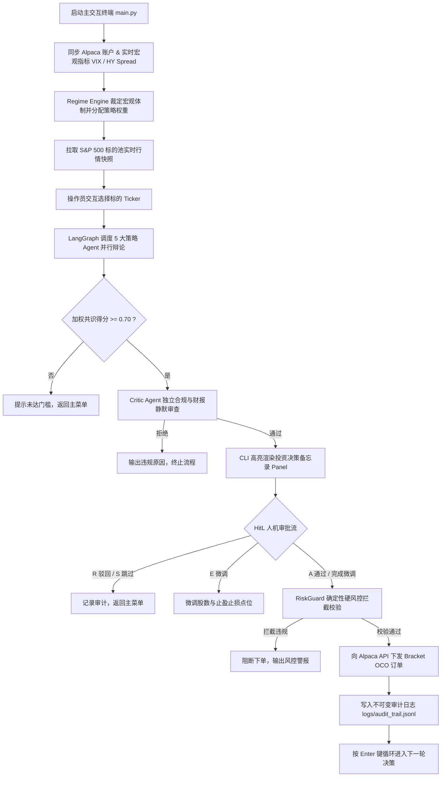

# AiAgentForTrading

基于 **Alpaca API**、**LangGraph 多智能体协同状态图** 与 **大语言模型（LLM）** 的全流程量化交易决策与风险治理系统。

系统集成了 **实时宏观体制检测（Market Regime）**、**5 大策略研究智能体并行辩论与共识**、**独立 Critic 审查**、**CLI 人机协同决策治理（Human-in-the-Loop）**、**确定性硬风控拦截（RiskGuard）** 以及 **15分钟持仓守护巡检引擎（Cron Sentinel）**。

---

## 🌟 核心特性

- **多智能体并行辩论与共识机制 (LangGraph StateGraph)**：
  - **Momentum Agent (动量策略)**：基于均线突破 (SMA)、RSI 与成交量异动捕捉趋势。
  - **Macro Agent (宏观基本面)**：结合 VIX 恐慌指数与 FRED 高收益信用利差评估风险偏好。
  - **StatArb Agent (统计套利)**：监控与 SPY 标杆的滚动相关系数与价差 Z-Score 均值回归。
  - **Contrarian Agent (逆向投资)**：利用市场恐慌情绪指数与超卖程度逆势布局。
  - **Exotic Agent (衍生品与事件驱动)**：分析期权看涨/看跌比率 (PCR) 与财报窗口日前瞻。
- **动态宏观体制裁定 (Regime Engine)**：
  - 自动识别 `Bull_Trend` (多头趋势)、`High_Vol_Bear` (高波熊市)、`Panic_Crisis` (恐慌危机) 与 `Neutral_Range` (震荡模式)。
  - 依据宏观模式动态调配 5 大策略的权重矩阵。
- **双重风控防御体系**：
  - **Critic 独立合规审查**：校验标的白名单、单仓杠杆率以及财报静默期（7天内有财报一票否决）。
  - **确定性 Python 硬风控 (RiskGuard)**：不依赖 LLM，代码级硬性拦截单仓上限 (4.8%)、板块集中度 (30%) 及单日最大回撤熔断 (5%)。
- **人机协同终端治理 (HitL CLI Terminal)**：
  - 丰富的富文本交互看板（`rich`），支持连续分析决策（REPL 循环）。
  - 一键执行审批 (`A`)、驳回 (`R`)、微调参数 (`E`) 或跳过 (`S`)。
  - 审批通过后自动向 Alpaca 下发带止盈止损的 **Bracket OCO 订单**。
- **不可变审计追踪 (Audit Trail)**：
  - 所有订单下发、参数变更与持仓自愈记录均写入不可篡改的 `logs/audit_trail.jsonl`。
- **15 分钟持仓守护巡检引擎 (Cron Sentinel)**：
  - 常驻后台定期检查持仓孤儿单，自动补齐缺失的止盈止损单，保障夜间持仓安全。

---

## 🏗️ 系统架构流程



---

## 📁 项目目录结构

```text
AiAgentForTrading/
├── cli/
│   └── terminal_ui.py             # 终端富文本渲染面板 (Rich Investment Memo)
├── config/
│   ├── settings.yaml              # 全局配置 (Alpaca / Featherless / 风控阈值)
│   ├── investment_memo.yaml       # Critic 独立审查合规规则
│   └── sp500_universe.json        # 标普 500 核心标的池白名单
├── core/
│   ├── agents/                    # 5 大策略研究 Agent 与 Critic Agent
│   │   ├── base_agent.py          # 智能体基类 (抽象评估接口与 LLM 封装)
│   │   ├── momentum_agent.py      # 动量趋势智能体
│   │   ├── macro_agent.py         # 宏观基本面智能体
│   │   ├── statarb_agent.py       # 统计套利智能体
│   │   ├── contrarian_agent.py    # 逆向反转智能体
│   │   ├── exotic_agent.py        # 衍生品与事件驱动智能体
│   │   └── critic_agent.py        # 独立审查智能体 (一票否决权)
│   ├── alpaca_client.py           # Alpaca API 统一网关客户端 (执行与行情)
│   ├── consensus_engine.py        # 基于 LangGraph 的多智能体辩论与加权引擎
│   ├── regime_engine.py           # 宏观体制状态机引擎 (VIX / HY Spread)
│   ├── risk_guard.py              # 确定性 Python 硬风控校验器
│   └── logger.py                  # 日志基础设施
├── logs/
│   └── audit_trail.jsonl          # 真实交易审计追踪日志 (JSON Lines)
├── sentinel/
│   └── cron_sentinel.py           # 15 分钟持仓守护巡检与自愈守护引擎
├── tests/                         # 完整的自动化测试套件
│   ├── test_alpaca_client.py      # Alpaca 接口集成与 Mock 单元测试
│   ├── test_fetch_regime_real.py  # 真实宏观数据拉取测试
│   ├── test_regime_engine.py      # 状态机逻辑测试
│   └── test_risk_guard.py         # 硬风控全规则边界测试
├── main.py                        # CLI 交互式终端主入口
├── pyproject.toml                 # 项目依赖与工具链配置 (uv / pytest / pylint)
├── requirements.txt               # Python 依赖清单
└── README.md                      # 项目说明文档
```

---

## 🚀 快速上手

### 1. 环境准备
推荐使用高性能 Python 包管理器 [uv](https://github.com/astral-sh/uv)：

```powershell
# 克隆仓库
git clone https://github.com/Tonytan123/AiAgentForTrading.git
cd AiAgentForTrading

# 安装项目所有依赖
uv sync
```

### 2. 配置 API 凭证
支持在 `config/settings.yaml` 中配置，或直接设置环境变量：

```powershell
# Alpaca 模拟盘 API Key & Secret Key
$env:ALPACA_API_KEY="你的_ALPACA_KEY"
$env:ALPACA_SECRET_KEY="你的_ALPACA_SECRET"

# Featherless LLM API Key (用于多 Agent 并行辩论)
$env:FEATHERLESS_API_KEY="你的_FEATHERLESS_KEY"

# (可选) 美联储 FRED API Key
$env:FRED_API_KEY="你的_FRED_KEY"
```

> 💡 **提示**：若在本地 `config/settings.yaml` 中填入了真实密钥，建议运行 `git update-index --skip-worktree config/settings.yaml` 防止 Git 意外提交敏感配置。

---

## 💻 运行系统

### 1. 启动交互式交易终端 (CLI Terminal)

```powershell
uv run python main.py
```

- **查看大盘与资产**：系统自动同步 Alpaca 账户净值、现金余额、VIX 指数、宏观体制和 S&P 500 标的池行情。
- **选择标的**：输入序号（如 `1`、`2`）或代码（如 `AAPL`）。
- **人机协同决策**：查看 5 大 Agent 的详细分析理由与 Critic 审查结果，输入 `A` 确认下单，或 `E` 微调参数。
- **安全退出**：输入 `exit` 或 `q` 随时退出系统。

### 2. 运行 15 分钟持仓守护引擎 (Cron Sentinel)

在后台或独立窗口运行，保障持仓安全：

```powershell
uv run python -c "from sentinel.cron_sentinel import CronSentinel; sentinel = CronSentinel(paper=True); sentinel.run_daemon()"
```

### 3. 运行自动化测试套件

```powershell
uv run pytest
```

---

## ⚙️ 配置文件说明 (`config/settings.yaml`)

```yaml
alpaca:
  api_key: "YOUR_ALPACA_API_KEY"
  secret_key: "YOUR_ALPACA_SECRET_KEY"
  paper: true # true 为 Paper 模拟盘，false 为实盘

featherless:
  base_url: "https://api.featherless.ai/v1"
  api_key: "YOUR_FEATHERLESS_API_KEY"
  model: "Qwen/Qwen2.5-72B-Instruct" # 推荐使用强逻辑开源大模型

risk:
  max_single_position_pct: 0.048  # 单仓上限 4.8%
  max_sector_exposure_pct: 0.30   # 单板块敞口上限 30%
  max_drawdown_limit_pct: 0.05    # 单日最大回撤熔断 5%
  max_leverage: 1.0               # 最大杠杆率限制 1.0x

strategy:
  take_profit_multiplier: 1.08    # 止盈目标 +8%
  stop_loss_multiplier: 0.96      # 止损目标 -4%
  consensus_threshold: 0.70       # 辩论入场共识得分阈值 (>=0.70)
```

---

## 📜 许可证

本项目采用 [MIT License](LICENSE) 许可证。
