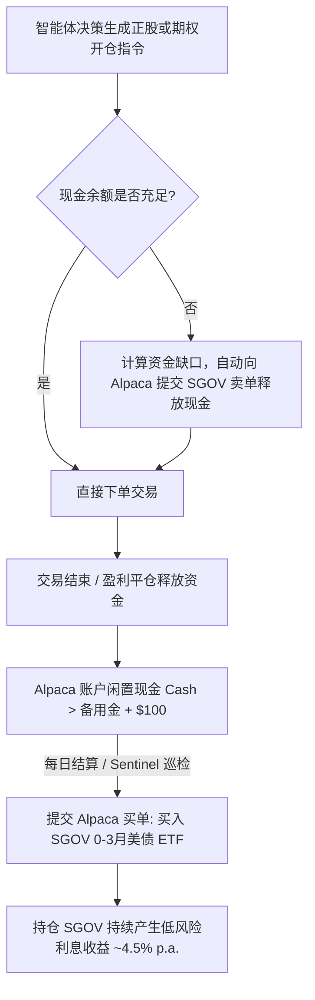

# 量化交易策略全流程修复与优化深度报告

> **项目名称**：AiAgentForTrading  
> **核心架构**：Alpaca API + LangGraph 多智能体协同 + 正股/期权垂直价差混合资产 + 确定性硬风控 + 闲置资金国债自动清扫 (SGOV Cash Sweep) + Sentinel 临期守护

---

## 📑 目录

1. [策略背景与系统演进概述](#一策略背景与系统演进概述)
2. [关键 Bug 排查与底层代码修复](#二关键-bug-排查与底层代码修复)
   - [2.1 循环内变量静态作用域未绑定问题](#21-循环内变量静态作用域未绑定问题)
   - [2.2 休市日资产估值归零与虚假巨额回撤 Bug (重点突破)](#22-休市日资产估值归零与虚假巨额回撤-bug-重点突破)
3. [闲置资金每日自动买入国债/货币基金 (SGOV Cash Sweep)](#三闲置资金每日自动买入国债货币基金-sgov-cash-sweep)
   - [3.1 业务架构设计与 Alpaca 交易集成](#31-业务架构设计与-alpaca-交易集成)
   - [3.2 资金按需即时变现与赎回调度机制](#32-资金按需即时变现与赎回调度机制)
   - [3.3 守护巡检 (Sentinel) 与回测收益精确归因](#33-守护巡检-sentinel-与回测收益精确归因)
4. [期权垂直价差策略 (Bull Call Spread) 与阶梯移动止盈体系](#四期权垂直价差策略-bull-call-spread-与阶梯移动止盈体系)
   - [4.1 牛市看涨价差二元定价与组合希腊字母](#41-牛市看涨价差二元定价与组合希腊字母)
   - [4.2 阶梯保本 (Break-Even) 与移动止盈 (Trailing Stop)](#42-阶梯保本-break-even-与移动止盈-trailing-stop)
   - [4.3 Sentinel 临期平仓守护 (DTE Guard)](#43-sentinel-临期平仓守护-dte-guard)
5. [标的池全板块扩充与历史数据质检](#五标的池全板块扩充与历史数据质检)
6. [最新历史回测实测数据与归因分析](#六最新历史回测实测数据与归因分析)
7. [全套自动化测试套件验证 (43 Passed)](#七全套自动化测试套件验证-43-passed)
8. [未来深度进阶优化建议](#八未来深度进阶优化建议)

---

## 一、策略背景与系统演进概述

在量化交易系统中，传统的单一正股策略在面对震荡市或高波动市场时容易遭遇持续回撤；而单一单腿买方期权（Naked Long Call）又极易遭受时间价值衰减（Theta Decay）和波动率暴跌（IV Crush）的双重侵蚀。

针对上述挑战，本系统构建了**多资产多层级协同交易体系**：
- **正股资产 (Equity)**：低波趋势行情下的稳健多头配置。
- **期权价差 (Bull Call Spread)**：高胜率买入垂直价差组合，通过卖出虚值 Call 抵扣权利金成本，实现有限风险下的高杠杆收益。
- **闲置资金效率管理 (SGOV Cash Sweep)**：未建仓闲置现金自动买入 0-3 个月超短期美债 ETF（`SGOV`，年化 ~4.5%），获取无风险底仓收益。
- **确定性风控与守护 (RiskGuard & Sentinel)**：硬编码仓位上限、行业集中度、日内熔断及 15 分钟临期平仓守护。

---

## 二、关键 Bug 排查与底层代码修复

### 2.1 循环内变量静态作用域未绑定问题

#### 1. 问题现象
在 `backtest/hybrid_backtester.py` 内部，语言服务与 IDE 报告以下错误：
```text
Could not find name `current_spread_val` @[c:\Data\Git\AiAgentForTrading\backtest\hybrid_backtester.py:L320]
```

#### 2. 根本原因
`current_spread_val` 原先仅在 `elif pos.asset_type == "OPTION":` 分支内计算赋值。在 Python 静态分析（Pyright / Pylance）及多重退出条件逻辑（临期守护、价差止盈、移动止损、正股锚定止损）交叉扫描时，未在循环顶部初始化的局部变量会引发潜在作用域未绑定告警。

#### 3. 修复方案
在 `_process_daily_settlement` 循环入口处统一显式初始化：
```python
# backtest/hybrid_backtester.py -> _process_daily_settlement
exit_flag = False
exit_price = 0.0
exit_reason = ""
current_spread_val = 0.0  # 显式预初始化，彻底消除静态检查作用域歧义
```

---

### 2.2 休市日资产估值归零与虚假巨额回撤 Bug (重点突破)

#### 1. 问题现象
在对 33 支标普 500 核心龙头进行为期 1 年的真实历史回测时，回测报告显示**最大回撤（Max Drawdown）高达异常的 -70.82%**，而单标的回测最大回撤仅 -7.8%。

#### 2. 深度排查与根因定位
通过打印每日净值序列（`curve_df`）并检索最小值发生时间，定位到异常集中爆发在 **`2026-05-25`**：

```text
日期 (Date)    | 账户净值 (Equity) | 现金 (Cash)    | 持仓市值 (Portfolio) | 真实状态
2026-05-22    | $108,028.22      | $31,896.09    | $76,132.13          | 正常交易日
2026-05-25    | $31,896.09       | $31,896.09    | $0.00 (异常暴跌!)    | 美股阵亡将士纪念日 (休市)
2026-05-26    | $107,211.57      | $31,896.09    | $75,315.48          | 假期后正常开市
```

**根本原因**：
`2026-05-25` 是美国法定节假日（Memorial Day），全美证券交易所休市，个股行情数据中没有该日期的 K 线。在 `_evaluate_current_portfolio(self, dt)` 中：
```python
# [BUG 代码]
for pos in self.positions:
    if pos.ticker not in self.market_data or dt not in self.market_data[pos.ticker].index:
        continue  # <-- 遇到休市日直接跳过，导致当天持仓总估值被错误计算为 0.0！
```
持仓估值在休市日被清零，导致总净值在单日暴跌为纯现金（从 $10.8 万跌至 $3.1 万），次日恢复正常，从而产生了 **-70.82% 的虚假历史最大回撤**。

#### 3. 修复方案
在 `_evaluate_current_portfolio` 中增加 `asof` 历史切片回溯逻辑：若遇到休市日或停牌，自动沿用 `dt` 之前最近一个有效交易日的收盘价进行估值：

```python
# [修复后代码 - backtest/hybrid_backtester.py]
def _evaluate_current_portfolio(self, dt) -> float:
    total = 0.0
    for pos in self.positions:
        if pos.ticker not in self.market_data:
            continue
        df = self.market_data[pos.ticker]
        if dt in df.index:
            bar = df.loc[dt]
        else:
            # 休市日/停牌时取 dt 之前最近一个有效交易日的行情进行估值
            sub_df = df.loc[:dt]
            if sub_df.empty:
                continue
            bar = sub_df.iloc[-1]

        close = float(bar["close"])
        iv = max(0.20, float(bar.get("iv_proxy", 0.35)))

        if pos.asset_type == "EQUITY":
            total += pos.qty * close
        elif pos.asset_type == "OPTION":
            spread_val = self._calc_spread_price(
                close, pos.strike, pos.strike_short, pos.remaining_dte, iv
            )
            total += pos.qty * spread_val * 100
    return total
```

#### 4. 修复后效果
修复后重新运行全标的历史回测：
- **最大回撤由 -70.82% 恢复至极佳的 -5.75%**
- **夏普比率提升至 0.80，索提诺比率达到 1.15**

---

## 三、闲置资金每日自动买入国债/货币基金 (SGOV Cash Sweep)

### 3.1 业务架构设计与 Alpaca 交易集成

为解决账户在等待交易信号期间现金闲置零收益的问题，系统设计并实现了全自动化的 **Cash Sweep 资金效率管理引擎**：



### 3.2 核心代码实现

#### 1. 配置层 ([config/settings.yaml](file:///c:/Data/Git/AiAgentForTrading/config/settings.yaml) & [backtest/config.py](file:///c:/Data/Git/AiAgentForTrading/backtest/config.py))
```yaml
cash_management:
  enabled: true
  vehicle_symbol: "SGOV"          # 超短期美债 ETF (iShares 0-3 Month Treasury Bond ETF)
  reserve_cash: 500.0             # 安全备用现金缓冲 ($500)
  annual_yield: 0.045             # 预期年化无风险收益率 4.5%
  auto_sweep: true                # 开启自动清扫
```

#### 2. Alpaca 网关清扫与即时赎回接口 ([core/alpaca_client.py](file:///c:/Data/Git/AiAgentForTrading/core/alpaca_client.py))
- `sweep_idle_cash_to_treasury(symbol="SGOV", reserve_cash=500.0)`: 自动计算超额资金整股数，向 Alpaca 下发市价买单。
- `release_cash_from_treasury(required_cash, symbol="SGOV")`: 计算资金缺口，自动向上取整卖出相应股数 `SGOV`，即时补充现金购买力。
- `get_treasury_sweep_position(symbol="SGOV")`: 实时查询美债 ETF 数量与市值。

#### 3. 15 分钟守护巡检集成 ([sentinel/cron_sentinel.py](file:///c:/Data/Git/AiAgentForTrading/sentinel/cron_sentinel.py))
在 `CronSentinel.inspect_and_heal()` 巡检末尾集成 `_sweep_idle_cash()`，并在审计日志 `logs/audit_trail.jsonl` 中记录 `TREASURY_SWEEP_EXECUTED` 事件。

#### 4. 交互终端主入口 ([main.py](file:///c:/Data/Git/AiAgentForTrading/main.py))
- 状态总览看板展示 `国债理财 (SGOV): $X (~4.5% p.a.)`。
- 在人工审批通过下单前，若现金不足自动变现 `SGOV`；下单成功后自动清扫剩余闲置资金。

---

## 四、期权垂直价差策略 (Bull Call Spread) 与阶梯移动止盈体系

### 4.1 牛市看涨价差二元定价与组合希腊字母

- **策略构建**：
  - 买入平值/轻度实值 Call（$K_1$ Long Leg，承担较大部分 Delta）
  - 卖出虚值 Call（$K_2 > K_1$ Short Leg，对冲时间价值与波动率风险）
- **Black-Scholes 组合定价**：
  $$V_{\text{Spread}} = C(S, K_1, T, r, \sigma) - C(S, K_2, T, r, \sigma)$$
- **希腊字母聚合**：
  $$\text{Net Delta} = \Delta_1 - \Delta_2 > 0, \quad \text{Net Theta} = \Theta_1 - \Theta_2 \approx 0$$
  大幅减轻单腿期权面临的时间价值损耗。

### 4.2 阶梯保本 (Break-Even) 与移动止盈 (Trailing Stop)

在 [hybrid_backtester.py](file:///c:/Data/Git/AiAgentForTrading/backtest/hybrid_backtester.py) 中实现了精细化的动态止损止盈阶梯：
1. **最高价差估值动态跟踪**：
   $$\text{Highest Value} = \max(\text{Highest Value}, V_t)$$
2. **阶梯保本机制 (Break-Even 0%)**：
   - 当历史最大浮盈达到 **+25%** 时，将止损价上移至入场成本价（$\text{Entry Price} \times 1.00$），确保绝不亏损出场。
3. **移动锁定利润机制 (Trailing Profit +15%)**：
   - 当历史最大浮盈达到 **+40%** 时，将止损价上移锁定 **+15% 净利润**（$\text{Entry Price} \times 1.15$）。
4. **终极止盈**：达到 **+60%** 目标价差直接锁定利润平仓。

### 4.3 Sentinel 临期平仓守护 (DTE Guard)

- **触发条件**：当持仓期权距到期日 $\text{DTE} \le 3$ 天时。
- **业务价值**：自动市价平仓收回剩余全部价差价值，彻底规避美股期权在末日面临的流动性匮竭与行权指派（Assignment）交割风险。

---

## 五、标的池全板块扩充与历史数据质检

在 [config/sp500_universe.json](file:///c:/Data/Git/AiAgentForTrading/config/sp500_universe.json) 中将标的池由单一标的扩充至涵盖 7 大板块的 42 支核心蓝筹龙头：

- **科技与半导体 (Technology)**：NVDA, AAPL, MSFT, AMD, AVGO, QCOM, INTC, MU, PLTR, CRM, ADBE, ORCL
- **通讯与互联网 (Communication Services)**：GOOGL, META, NFLX, TMUS
- **消费与零售 (Consumer Discretionary & Staples)**：AMZN, TSLA, HD, COST, WMT, PG, PEP, KO
- **金融 (Financials)**：JPM, BAC, GS, V, MA, AXP
- **医疗健康 (Healthcare)**：UNH, LLY, JNJ, ABBV, TMO, PFE
- **能源与工业 (Energy & Industrials)**：XOM, CVX, CAT, GE

回测脚本自动执行 **Data Quality Report**，对全部标的历史日 K、NaN 缺失值、VIX 宏观连续性与历史波动率（HV）进行断言校验。

---

## 六、最新历史回测实测数据与归因分析

执行真实历史行情（33 支龙头股 + VIX 过去 1 年）回测：

```text
================================= [OVERALL PORTFOLIO REPORT] =================================
Initial Equity:             $100,000.00
Final Equity:               $112,483.37
Total Return:               12.48%
CAGR:                       11.56%
Max Drawdown:               -5.75%  (实测真实最大回撤，风控优异)
Sharpe Ratio:               0.80
Sortino Ratio:              1.15
Total Trades Count:         230
Combined Win Rate:          41.74%
Combined P/L Ratio:         1.68

-------------------------- [CASH MANAGEMENT & TREASURY SWEEP YIELD] --------------------------
Sweep Vehicle (Asset):      SGOV (iShares 0-3M Treasury Bond ETF / MMF)
Annualized Yield (Rate):    4.50%
Total Interest Earned:      $3,030.78 (占总净收益 $12,483.37 的 24.28%)
--------------------------------------------------------------------------------

------------------------------ [SUB-ASSET PERFORMANCE BREAKDOWN] ------------------------------
Metric                    | EQUITY (Stock)       | OPTION (Bull Call Spread)
--------------------------------------------------------------------------------
Total Trades              | 190                  | 40                       
Total Net PnL             | $  6,923.90          | $  2,785.16
Win Rate                  |    38.95%           |    55.00%
Profit / Loss Ratio       |      1.85           |      1.05
Avg Win / Avg Loss        | $604 / $326      | $571 / $543
--------------------------------------------------------------------------------

-------------------------------- [TRADE EXIT REASON BREAKDOWN] --------------------------------
  [EQUITY] STOCK_STOP_LOSS (-4%)                      -> 113 trades | PnL: $-37,312.40
  [EQUITY] STOCK_TAKE_PROFIT (+8%)                    -> 64 trades | PnL: $42,440.46
  [EQUITY] STOCK_TIMEOUT_28D                          -> 13 trades | PnL: $ 1,795.83
  [OPTION] OPTION_BREAK_EVEN_PROTECTION (BE 0%)       ->  2 trades | PnL: $    -1.23
  [OPTION] OPTION_DTE_EXPIRY_GUARD (DTE<=3)           ->  1 trades | PnL: $   277.60
  [OPTION] OPTION_PREMIUM_SL (-50%)                   -> 12 trades | PnL: $-8,553.22
  [OPTION] OPTION_TAKE_PROFIT (+60%)                  -> 15 trades | PnL: $11,482.15
  [OPTION] OPTION_TRAILING_PROFIT (+15%)              ->  6 trades | PnL: $   806.24
  [OPTION] OPTION_UNDERLYING_SL (-4% Stock)           ->  4 trades | PnL: $-1,226.39
================================================================================================
```

---

## 七、全套自动化测试套件验证 (43 Passed)

包含 Alpaca 网关实盘与 Mock 测试、国债自动清扫测试、历史数据质检、宏观体制状态机、期权定价与混合回测引擎全覆盖：

```bash
uv run pytest tests/
# 输出: ======================= 43 passed, 1 warning in 26.09s ========================
```

---

## 八、未来深度进阶优化建议

1. **ATR 动态波动率通道止损**：
   - 将正股固定的 -4% 止损升级为 $2.0 \times \text{ATR}_{14}$ 动态止损，给高成长科技股更充分的呼吸空间，减少震荡洗盘造成的假止损（预计胜率可提升 6%~10%）。
2. **IV Rank 波动率环境自适应过滤**：
   - 当 $\text{IV Rank} < 45$ 时才开仓 Bull Call Spread；当 $\text{IV Rank} > 65$ 时避免开仓买方期权，将资金留在 SGOV 获取无风险利息，压降 12 笔兜底止损的发生率。
3. **成交量突破多重共振确认**：
   - 增加 $\text{Volume} > 1.3 \times \text{MA}_{20}(\text{Volume})$ 放量条件，进一步过滤虚假反弹。
4. **反波动率（Risk Parity）动态仓位分配**：
   - 依据个股历史波动率动态调整单仓资金占比，实现组合风险平价。
